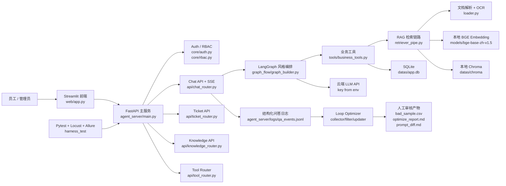

# 系统架构

Knowledge Agent 采用三层解耦：主服务、前端演示、测试与优化闭环。业务数据、制度文档、Embedding、向量库、OCR 都在本机运行；只有 LLM 生成层通过环境变量配置云端 API。

## 数据流

1. 用户在 Streamlit 登录，前端保存 token 并调用 FastAPI。
2. 对话请求进入 `chat_router`，后端检查 Bearer token 和 RBAC。
3. Graph 节点执行身份检查、文档检索、历史工单匹配、LLM 决策。
4. RAG 使用本地制度文档、本地 BGE Embedding、本地 Chroma 和关键词兜底。
5. LLM 只接收检索上下文和问题，不接收数据库文件或原始文档目录。
6. 需要工单时写入 SQLite，并将工具事件通过 SSE 返回给前端。
7. 问答结果写入结构化 JSONL，M5 离线读取并生成审核建议。

## 安全边界

- `.env` 不入文档、不入日志、不入测试输出。
- 测试通过 `APP_DB_PATH`、`DATAS_DIR`、`CHROMA_DIR`、`QA_LOG_PATH` 使用临时目录。
- M5 只生成建议文件，不直接修改 `prompt_template.py`，不自动重建生产向量库。
