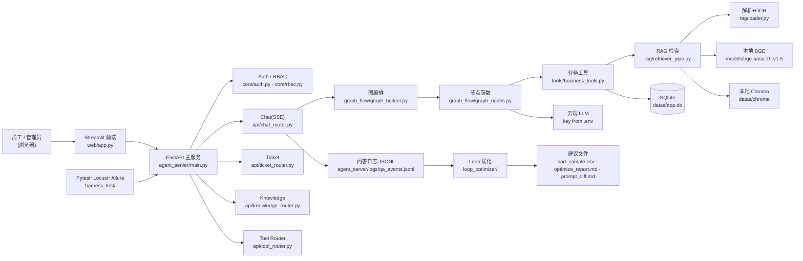

# Knowledge Agent 学习指南

> 面向**第一次接触本项目、想从零搞懂并上手改代码**的人。
> 配套文档：《使用说明书.md》（怎么用）、《README.md》（概览）、《docs/》（架构/API/演示）。

读这份指南的顺序建议：第 1～2 章建立直觉 → 第 3～4 章看全貌与一次请求的完整链路 → 第 5～8 章按模块细读 → 第 9～11 章测试和闭环 → 第 12～14 章动手改、避坑、讲清楚。

---

## 1. 这个项目到底是什么（大白话）

公司里常有这种场景：新人问"差旅报销上限多少""年假怎么算""服务器宕机先找谁"，答案都写在某几份制度 PDF 里，但没人记得住、也搜得慢。

本项目做了一个**本机跑的网页机器人**来解这个问题：

- 管理员把制度 PDF / Word 上传进来，系统把文字"切块 + 转成向量"存进本地向量库；
- 员工在网页提问，系统在本地向量库里找出最相关的几段，连同问题和最近聊天记录一起发给**云端大模型**；
- 大模型基于这些材料生成回答，并决定是否建议建工单；
- 员工可一键创建工单，管理员在网页上审批。

一句话定位：**本地 RAG 知识库 + 工具型对话 Agent + 工单流转 + 完整测试/压测/半自动优化闭环**，全栈跑在本机，只有"大模型生成"这一环上云。

类比帮助理解：
- "RAG" ≈ 开卷考试：先翻书（检索）找到相关页，再把书和人问题一起交给学霸（大模型）作答，不许瞎编。
- "Agent / 工具" ≈ 给大模型配了几个"小助手"（查知识库、查历史工单），它决定要不要叫、叫哪个。
- "LangGraph 风格" ≈ 把流程画成一张有顺序的图（节点 + 连线），一步步跑。本项目是**自己实现**的极简版图（见第 12 章边界说明）。

---

## 2. 先搞懂的 10 个核心概念

| 概念 | 是什么 | 在本项目里 |
| --- | --- | --- |
| **RAG** | Retrieval-Augmented Generation，检索增强生成：先检索相关资料，再让大模型基于资料回答 | 对话前先用本地向量库检索制度片段，拼进提示词 |
| **Embedding（向量化）** | 把文字变成一串数字（向量），语义相近的文字向量也相近 | `models/bge-base-zh-v1.5` 本地模型，输出 768 维向量 |
| **向量库 / Chroma** | 存海量向量、按"相似度"快速找最近邻的数据库 | `datas/chroma/`，集合名 `company_policy_docs` |
| **BM25 / 关键词兜底** | 传统关键词检索，作为向量检索失效时的兜底 | `rag/retriever_pipe.py` 的 `keyword_search` |
| **Reranker（重排）** | 对初筛结果再精排，提升 Top-1 准确率 | 本地 `bge-reranker-base`，需 `RERANKER_ENABLED=true` 且权重就位才启用 |
| **Agent / 工具（Tool）** | 让大模型能调用外部函数获取信息或执行动作 | `tools/business_tools.py` 的 6 个工具，经 RBAC 管控 |
| **LangGraph 风格编排** | 用"有向图"组织多个处理节点（非真 LangGraph 依赖） | `graph_flow/` 自研 `DirectedAgentGraph` |
| **FastAPI** | Python Web 后端框架，自带 Swagger 文档、支持流式 SSE | `agent_server/main.py` |
| **Streamlit** | 用 Python 写网页 UI 的轻量框架，适合演示 | `web/app.py` |
| **SSE** | Server-Sent Events，服务端单向持续推送（打字机效果 + 工具事件） | `/api/chat/stream` |
| **RBAC** | 基于角色的访问控制：不同角色能用不同功能 | `core/rbac.py`，admin / employee |
| **SQLite** | 单文件关系数据库，存用户/工单/文档/聊天记录 | `datas/app.db` |

**数据流一句话**：浏览器(Streamlit) → FastAPI → 鉴权+RBAC → 图编排 → 工具(本地RAG检索/查工单) → 云端LLM生成 → 通过 SSE 把"工具事件 + 回答"推回浏览器。

---

## 3. 系统全景架构（三层解耦）



三层职责分工：
1. **主服务层** `agent_server/`：路由 + 图编排 + RAG 检索 + 业务工具 + 核心组件。
2. **前端层** `web/`：Streamlit 四页（登录/对话/工单/上传/账号），只调 API，不直接连向量库。
3. **测试与闭环层** `harness_test/` + `loop_optimizer/`：功能/边界/压测 + 半自动优化建议（人审后生效）。

---

## 4. 一次问答是怎么跑完的（端到端调用链）

以员工在前端提问"差旅报销标准是什么"为例，**真实函数调用顺序**：

1. **前端** `web/app.py` 的 `render_chat()` → 调 `web/frontend_api.py` 的 `stream_chat(question, token, api_base_url)`。
2. `frontend_api.stream_chat()` 发 `POST {base}/api/chat/stream`，带 `Authorization: Bearer <token>`，并用 `parse_sse_events()` 逐行解析事件流。
3. **后端路由** `agent_server/api/chat_router.py`：`@router.post("/stream")` → `chat_stream()` 调 `run_agent_events(current_user, message)`；把每个事件包成 `event: <名>\ndata: <json>`，`done` 时调 `save_chat_history()`。
4. **图编排** `agent_server/graph_flow/graph_builder.py`：`run_agent_events()` → `build_graph().stream()`。`build_graph()` 返回 `DirectedAgentGraph`，节点顺序固定为 `identity → rag → llm`，`max_tool_rounds=3`。
5. **节点** `agent_server/graph_flow/graph_nodes.py`：
   - `identity_check_node(state)`：追加 `{tool:"identity_check"}` 事件。
   - `parallel_rag_node(state)`：调 `doc_retrieve(...)` 和 `match_similar_ticket(...)`（来自 `tools/business_tools.py`），写入 `state.rag_results` / `state.similar_tickets`，追加工具事件。
   - `llm_decision_node(state)`：`build_agent_context()`（最近 5 条聊天 + 检索片段）→ `decide_with_llm()`（调 `core/llm_client.stream_chat_completion`，解析 JSON `{answer, needs_ticket, title}`）→ `guardrail_check()` → 写入 `state.llm_answer` / `state.ticket_suggestion`。
6. **工具** `agent_server/tools/business_tools.py`：`doc_retrieve()` 先 `ensure_tool_allowed(role,"doc_retrieve")` 做权限校验，再调 `rag.retriever_pipe.retrieve(query, top_k)`；`match_similar_ticket()` 查 `db.list_tickets()` 做关键词打分。
7. **RAG** `agent_server/rag/retriever_pipe.py` 的 `retrieve(query, top_k=5)`：向量检索（Chroma）→ BM25 兜底 → `rerank()`（启用时）→ `_threshold_filter()`（向量阈值 `RAG_SIMILARITY_THRESHOLD=0.70`）→ 必要时 BM25 补位 → 返回 `RetrievalResult` 列表，每个含 `content/score/source_path`。
8. **回传**：`output_node(state)` 汇总答案、工具事件、检索结果、护栏结果；图按运行顺序 emit 每个 `tool` 事件，最后 emit 一个 `done` 事件（含最终答案与工单建议）。
9. **前端渲染**：`web/app.py` 逐个渲染工具事件，打字机式输出回答；若 `done` 含工单建议，显示"创建工单"按钮。

> 非流式接口 `/api/chat`（同步返回）走同一条图，只是用 `run_agent()`（`invoke`）而非 `run_agent_events()`（流式）。

---

## 5. 目录结构与模块职责

```text
knowledge_agent/
├── agent_server/              主服务（FastAPI）
│   ├── main.py                FastAPI 入口：注册 5 个 router、2 个中间件、/health、启动初始化连接池
│   ├── smoke_test.py          M2 端到端冒烟（TestClient：注册→登录→提问→查工单）
│   ├── core/
│   │   ├── auth.py            PBKDF2 密码哈希、注册/登录/发 token、get_current_user
│   │   ├── rbac.py            role_tier / available_tools / ensure_tool_allowed（越权 403）
│   │   ├── db.py              SQLite 连接池 + 建表 + 全部 CRUD（user/ticket/chat_history/doc）
│   │   ├── config.py          get_llm_settings() 读 AGNES/ARK 环境变量
│   │   ├── llm_client.py      OpenAI 兼容客户端；chat/stream 补全；mock 开关
│   │   └── qa_logger.py       写 agent_server/logs/qa_events.jsonl
│   ├── rag/
│   │   ├── loader.py          读 PDF/DOCX/DOC；表格→Markdown；插图 PaddleOCR/VLM
│   │   ├── chunker.py         切块（默认 500/overlap 50，表格/插图整块保留）
│   │   ├── embed_loader.py    本地 BGE 加载；embed_texts / embed_query（768 维）
│   │   ├── vector_store.py    RagVectorStore 封装 Chroma（rebuild/upsert/query）
│   │   ├── reranker.py        本地 bge-reranker 重排；reranker_enabled()
│   │   ├── retriever_pipe.py  retrieve()：向量→重排→BM25→阈值；rebuild_index()
│   │   └── smoke_test.py      M1 RAG 自检
│   ├── tools/
│   │   ├── schemas.py         Pydantic 入参模型 + validate_user_text()
│   │   └── business_tools.py  6 个工具实现 + TOOL_REGISTRY + call_tool()
│   ├── graph_flow/
│   │   ├── state.py           AgentState 数据类
│   │   ├── prompt_template.py SYSTEM_PROMPT + build_decision_messages()
│   │   ├── graph_nodes.py     节点函数（identity/rag/llm/output/guardrail）
│   │   └── graph_builder.py   build_graph / run_agent / run_agent_events（真正被调用的编排）
│   └── api/
│       ├── utils.py           ok() 统一响应、限流中间件、全局异常处理
│       ├── auth_router.py     认证 + 账号管理接口
│       ├── chat_router.py     对话接口（含 SSE）
│       ├── ticket_router.py   工单 CRUD + 审批
│       ├── knowledge_router.py 知识库上传/删除/重建
│       └── tool_router.py     POST /api/tools/{tool_name}
├── web/                       Streamlit 前端
│   ├── app.py                 多页 UI（登录/对话/工单/上传/账号）
│   ├── frontend_api.py        调后端 + 解析 SSE + 中文工具事件描述
│   ├── local_launcher.py      Tkinter 一键启停 GUI
│   └── smoke_test.py          M3 接口冒烟（需服务已起）
├── common/                    跨模块基础
│   ├── models/                Pydantic：User/Ticket/Doc/RetrievalResult（见第 12 章说明）
│   ├── constants.py           路径、角色权限表、RAG 阈值、限流参数
│   ├── config_base.py         读环境变量基础工具
│   ├── exception.py           全局异常 + 错误码
│   ├── logger_base.py         统一日志（按天切割）
│   └── file_utils.py          文件锁 / IO 工具
├── harness_test/              测试闭环
│   ├── conftest.py / fixture/  pytest 配置与隔离夹具
│   ├── test_m0..m3_*.py       脚手架/RAG/Agent/前端 测试
│   ├── func/                  功能流（对话↔工单↔记忆↔知识库↔Loop↔文档）
│   ├── edge/                  边界/异常输入、隔离契约测试
│   ├── stress/locustfile.py   Locust 压测脚本
│   └── results/               m4_summary.json + locust CSV + allure
├── loop_optimizer/            半自动优化闭环
│   ├── run_loop.py            入口：collect → aggregate → write
│   ├── collector.py           读 JSONL 抽样本
│   ├── filter.py              去重聚合为发现
│   ├── rules.py               评分规则（低匹配/幻觉风险/高频）
│   ├── models.py              数据类
│   └── updater.py             产出 csv/md 建议文件
├── datas/                     制度文档 + chroma/ + app.db（本地数据，不上云）
├── models/                    bge-base-zh-v1.5/（已就位）+ reranker/、qwen2.5-vl/（可选）
├── docs/                      architecture.md / api_doc.md / demo_guide.md / resume_point.md
├── scripts/                   verify_readme.py / freshman_run.sh
├── requirements.txt           唯一依赖清单（187 个包，已装好，禁止 pip install）
├── .env / .env.example        密钥配置（.env 不入 Git）
└── run_harness.py             一键 func+edge+短压测+写结果
```

---

## 6. 关键模块导读（按阅读优先级）

**先读这几处，能最快建立全局观：**

1. `agent_server/main.py` —— 看路由怎么挂、中间件有哪些、启动时做什么。
2. `agent_server/api/chat_router.py` —— 系统的"主入口"，对话请求从这进。
3. `agent_server/graph_flow/graph_builder.py` —— 图怎么拼、三个节点叫什么。
4. `agent_server/graph_flow/graph_nodes.py` —— 每个节点具体干啥（检索、决策、护栏）。
5. `agent_server/rag/retriever_pipe.py` —— RAG 的"大脑"：`retrieve()` 的检索→兜底→重排→阈值。

**核心组件细读：**

- `core/auth.py`：密码用 **PBKDF2-HMAC-SHA256（26 万次迭代）** 哈希；登录发 `secrets.token_urlsafe(32)` 的 token 存库；`get_current_user` 从 `Authorization: Bearer` 解析并查库。
- `core/rbac.py`：`role_tier(role)` 把角色归为 admin/employee；`EMPLOYEE_TOOL_NAMES` 与 `ADMIN_TOOL_NAMES` 两套工具名集合；`ensure_tool_allowed(role, tool)` 未知返回 404、越权返回 403。**注意：真正的权限判定靠这套工具名集合，不是 `common/constants.ROLE_PERMISSIONS`**（见第 12 章）。
- `core/db.py`：`SQLitePool`（最多 4 连接、WAL 模式、忙等待 30s）。四张表：`user`（软删除）、`ticket`、`chat_history`、`doc`。库文件路径由 `APP_DB_PATH` 环境变量决定，默认 `datas/app.db`。
- `core/llm_client.py`：`get_client()` 用 `get_llm_settings()` 构造 OpenAI 兼容客户端；`KNOWLEDGE_AGENT_MOCK_LLM=1` 时返回假 JSON（压测防烧 token）。
- `rag/loader.py`：PDF 用 pdfplumber+fitz，DOCX 用 python-docx，`.doc` 走 soffice 转换兜底；表格转 Markdown 保留行列语义；插图用 PaddleOCR 抽字，可选 Qwen2.5-VL 增强（`VLM_ENABLED`）。
- `rag/embed_loader.py`：硬编码本地路径 `models/bge-base-zh-v1.5`，`local_files_only=True` 禁止联网，断言维度 768。
- `rag/vector_store.py`：Chroma 持久化到 `datas/chroma`，距离转分数 `1-d`；任何异常抛 `VectorStoreUnavailable`，检索链回退 BM25。
- `tools/business_tools.py`：每个工具先 `ensure_tool_allowed` 再干活；`TOOL_REGISTRY` 映射名字→(入参模型, 函数)，`call_tool()` 统一校验+鉴权+路由。
- `web/frontend_api.py`：`parse_sse_events()` 把 SSE 文本流解析成 `{event, data}`；`describe_tool_event()` 把工具名翻成中文提示。

---

## 7. 数据都存在哪了

| 数据 | 位置 | 说明 |
| --- | --- | --- |
| 制度原文 | `datas/*.pdf` / `*.docx` | 上传时存入 |
| 向量库 | `datas/chroma/` | Chroma 持久化，集合 `company_policy_docs` |
| 业务库 | `datas/app.db` | SQLite：user / ticket / chat_history / doc |
| 问答日志 | `agent_server/logs/qa_events.jsonl` | 每次对话一行 JSON，Loop 优化读取源 |
| 本地模型 | `models/bge-base-zh-v1.5/`（必须）、`models/bge-reranker-base/`、`models/qwen2.5-vl/`（可选） | Embedding 必装；重排/VLM 就位才启用 |
| 配置 | `.env`（本机）、`common/constants.py`（路径/阈值） | key 只走环境变量 |

> 测试与 Loop 会用临时目录（`harness_test/.tmp`）和 mock LLM，不会污染上面的生产数据。

---

## 8. 配置与密钥（环境变量一览）

| 变量 | 读取位置 | 默认 | 用途 |
| --- | --- | --- | --- |
| `AGNES_API_KEY` / `ARK_API_KEY` | `core/config.py` | 空 | LLM 密钥（二选一，主用 Agnes） |
| `AGNES_MODEL` / `ARK_MODEL` | `core/config.py` | `agnes-2.0-flash` | 模型名 |
| `AGNES_BASE_URL` / `ARK_BASE_URL` | `core/config.py` | `https://apihub.agnes-ai.com/v1` | OpenAI 兼容基址 |
| `LLM_TIMEOUT_SECONDS` | `core/config.py` | `60.0` | 请求超时 |
| `AGNES_TEMPERATURE` | `core/config.py` | `0.2` | 采样温度 |
| `KNOWLEDGE_AGENT_MOCK_LLM` | `core/llm_client.py` | 关 | 设 1 走假 LLM（压测用） |
| `RERANKER_ENABLED` | `rag/reranker.py` | `false` | 设 true 且权重就位才启用重排 |
| `VLM_ENABLED` | `rag/loader.py` | `true` | 插图 VLM 语义增强（需 bitsandbytes） |
| `LLM_EVAL_ENABLED` | `loop_optimizer/run_loop.py` | 关 | 占位（见第 12 章） |
| `DATAS_DIR` / `CHROMA_DIR` / `APP_DB_PATH` | `common/constants.py` / `core/db.py` | `datas/` 等 | 存储路径（测试用临时值覆盖） |
| `KNOWLEDGE_AGENT_DISABLE_RATE_LIMIT` | `api/utils.py` | 关 | 设 1 关闭限流 |
| `KNOWLEDGE_AGENT_API_BASE_URL` | `web/frontend_api.py` | `http://127.0.0.1:8000` | 前端调后端地址 |

`.env.example` 只列了 `AGNES_*` 与 `LLM_EVAL_ENABLED`；上表其余开关代码也支持，按需补充即可。

---

## 9. 测试与压测（harness_test）

设计目标：功能、边界、压测全覆盖，且**不污染生产数据、压测强制 mock LLM**（防烧 token）。

- `func/`：功能流（注册→对话→工单→记忆→知识库→Loop→文档校验）。
- `edge/`：坏输入、LLM 异常、损坏文件、隔离契约（验证测试间不串数据）。
- `stress/locustfile.py`：Locust 并发脚本，`KnowledgeAgentUser` 按权重打 chat/list_tickets/工具/health。
- `run_harness.py`：一键执行
  1. 校验必须是 Python 3.12.9；
  2. 设隔离环境（`DATAS_DIR/CHROMA_DIR/APP_DB_PATH` 指到 `harness_test/.tmp`，`KNOWLEDGE_AGENT_MOCK_LLM=1`、`DISABLE_RATE_LIMIT=1`，清空真实 key）；
  3. 跑 pytest（func+edge，产出 Allure）；
  4. 起 uvicorn 于随机端口等 `/health`；
  5. 按并发档（默认 50、100）跑 Locust；
  6. 写 `harness_test/results/m4_summary.json`。

命令：

```powershell
F:\code\knowledge_agent\.venv\Scripts\python.exe -m pytest harness_test -q
F:\code\knowledge_agent\.venv\Scripts\python.exe run_harness.py --stress-duration 10s
```

实测量化（来自 `harness_test/results/m4_summary.json`）：

| 并发 | 请求数 | QPS | P95 | 失败率 |
| --- | ---: | ---: | ---: | ---: |
| 50 | 668 | 73.811 | 1000 ms | 0.0% |
| 100 | 676 | 74.8723 | 2000 ms | 0.0% |

---

## 10. Loop 半自动优化闭环

目的：从真实问答里自动找"低质量样本"，产出**人审**优化建议，而非自动改线上 Prompt（安全、可控）。

流程：
1. 每次对话，`core/qa_logger.py` 写一行 `agent_server/logs/qa_events.jsonl`（含问题、回答、检索最高分、相似工单数、护栏结果、工具事件）。
2. `loop_optimizer/run_loop.py`：`collect_samples`（读 JSONL → `BadSample`）→ `aggregate_samples`（按归一化问题去重聚合 → `Finding`，带 `_suggestion()`）→ `write_outputs`（写三个文件到 `loop_optimizer/output/`）。
3. 产出：
   - `bad_sample.csv`：低匹配 / 高幻觉风险 / 高频问题样本。
   - `optimize_report.md`：汇总发现与建议。
   - `prompt_diff.md`：对 `graph_flow/prompt_template.py` 的**建议性 diff，不自动应用**。

命令：

```powershell
F:\code\knowledge_agent\.venv\Scripts\python.exe -m loop_optimizer.run_loop
```

> 这是"半自动"：脚本只给建议，工程师 review 后手动合并到 `prompt_template.py`。

---

## 11. 想改 / 加功能？扩展指南

### 11.1 新增一个业务工具（最典型的扩展）

以加 `my_tool` 为例，照 `export_ticket_stat` / `query_ticket_list` 的模式做：

1. **`tools/schemas.py`** 加 Pydantic 入参：
   ```python
   class MyToolInput(BaseModel):
       query: str
       @field_validator("query")
       @classmethod
       def _v(cls, v): return validate_user_text(v)
   ```
2. **`tools/business_tools.py`** 实现函数：
   ```python
   def my_tool(payload: MyToolInput, current_user: dict) -> dict:
       ensure_tool_allowed(current_user["role"], "my_tool")
       # ... 业务逻辑 ...
       return {"items": [...]}
   ```
3. **`core/rbac.py`** 把名字加进对应集合：
   - 仅管理员：`ADMIN_TOOL_NAMES`
   - 员工可用：`EMPLOYEE_TOOL_NAMES`
   （`ALL_TOOL_NAMES` / `available_tools` / `ensure_tool_allowed` 会自动识别）
4. **`tools/business_tools.py` 的 `TOOL_REGISTRY`** 加条目：
   ```python
   "my_tool": (MyToolInput, my_tool),
   ```
   `call_tool()`（被 `api/tool_router.py` 调用）即可路由 `POST /api/tools/my_tool`，自动做 Pydantic 校验 + RBAC。
5. `GET /api/auth/me` 已返回 `available_tools(role)`，新工具会自动对授权角色可见。

> ⚠️ 重要：对话**图**只硬编码调用了 `doc_retrieve` 与 `match_similar_ticket`（`parallel_rag_node`）。新工具默认只能经 `POST /api/tools/{tool_name}` 或专用 REST 路由调用，不会自动出现在对话里。要让对话"主动调用"，需改 `graph_nodes.parallel_rag_node` 的编排逻辑。

### 11.2 换 / 调 Embedding 或重排模型

- 换 Embedding：改 `rag/embed_loader.py` 的 `BGE_MODEL_PATH` 与 `EXPECTED_EMBEDDING_DIM`，并在 `vector_store.rebuild()` 重建索引（维度变了旧库不兼容）。
- 启用重排：把 `models/bge-reranker-base` 权重放好，设 `RERANKER_ENABLED=true`；`reranker.reranker_enabled()` 会同时检查开关与文件存在才生效。

### 11.3 加一个 REST 接口

在 `agent_server/api/` 下新建或扩展 router，用 `api/utils.ok()` 统一返回，加 `@router.xxx` 并在 `main.py` `include_router`。需要鉴权就在函数参数注入 `current_user: dict = Depends(get_current_user)`。

### 11.4 前端加页面 / 改交互

`web/app.py` 的 `main()` 按页分发；新页加一个 `render_xxx()`，在前端调 `frontend_api.py` 的封装函数（注意 SSE 用 `parse_sse_events`）。

---

## 12. 已知边界与注意事项（读代码务必知道）

这些点照实说明，避免误读或面试翻车：

1. **不是真 LangGraph**：图编排是 `graph_flow/graph_builder.py` 自研的 `DirectedAgentGraph`（固定 3 节点顺序），没有 `langgraph` 依赖。描述为"LangGraph 风格 / 自研有向图编排"更准确。
2. **普通对话不会自动建工单**：`llm_decision_node` 只产出 `state.ticket_suggestion`，从不在图内建单；`output_node` 的 `ticket_id` 恒为 `None`。工单只在员工点"创建工单"→ `POST /api/tickets` → `ticket_router.create_ticket` 时才落库（`pending`）。
3. **`create_consult_ticket` 工具已注册但图未调用**：它能经 `/api/tools/create_consult_ticket` 调用，但对话编排不触发。
4. **`common/constants.ROLE_PERMISSIONS` 不是权限判定源**：它只用于"校验角色名是否合法"。真正 RBAC 看 `core/rbac.py` 的工具名集合。
5. **`common/models` 的 `User/Ticket/Doc` 基本没被运行期使用**：业务流用的是 `db.py` 返回的普通 dict；只有 `RetrievalResult` 在 RAG 链路被真实消费。
6. **BGE 模型路径硬编码两处**：`rag/embed_loader.py` 与 `common/constants.py` 都写了同一路径，但 embed 加载器只用前者。
7. **重排 / VLM 默认不启用**：需权重就位 + 开关开启；默认 `RERANKER_ENABLED=false`，`VLM_ENABLED=true` 但依赖 `bitsandbytes`，未装则插图仍走 PaddleOCR 文本。
8. **`LLM_EVAL_ENABLED` 是占位**：`run_loop` 会读并打印，但 collector/filter/updater 里没有任何分支用到它——优化器完全是规则打分，没有 LLM 评估步骤。README 写"LLM 评估默认关闭"略夸张，实为未实现。
9. **`graph_nodes.py` 里有重复的 `run_agent/run_agent_events`（死代码）**：真正被 `chat_router` 调用的是 `graph_builder.py` 里的版本；读代码以 `graph_builder` 为准。
10. **`agent_server/smoke_test.py` 的 `assert ticket_id` 在 mock LLM 下会失败**：因为图内不建单（见第 2 点），该断言与实现存在不一致。

---

## 13. 面试 / 答辩怎么讲

**一句话**：基于 FastAPI + Streamlit + 本地 RAG + 自研有向图编排的企业内部知识库工单智能体，支持制度问答、主动工单、RBAC、压测与半自动 Loop 优化，数据全本地、仅 LLM 上云。

**量化点（真实数字）**：
- 压测 50/100 并发：QPS ≈ 74，P95 1000/2000 ms，失败率 0.0%。
- 全量 pytest：func+edge 通过（具体条数以 `pytest harness_test -q` 实跑为准）。
- 本地 BGE（768 维）+ Chroma + BM25 兜底，制度数据不出本机。
- Loop 闭环自动归集低质量样本并产出 `prompt_diff.md`，人审后生效。

**技术选型理由**：
- 本地 Embedding/向量库/OCR：零云端成本、数据不出域、可离线演示。
- SQLite 单文件：轻量、免部署数据库服务，适合演示。
- Streamlit：几乎零前端成本做可演示 UI，专注后端能力展示。
- 自研有向图：依赖少、可控、易讲清"检索→决策→护栏"流程。

**风险边界（如实说）**：
- Reranker / VLM 为"可插拔占位"，默认未启用，未跑通重排效果。
- 规则护栏是轻量比对（工单号/金额/条款 vs 检索内容），降低风险而非消除幻觉。
- 插图 OCR 能抽文字但流程箭头/上下游语义无法 100% 还原，精确流程问答建议制度文档补"步骤化文字"。
- 半自动闭环：建议需人审，非生产自动调参。

**常见追问应对**：
- "为什么不用真 LangGraph？" → 演示项目追求轻依赖与可控，自研 3 节点图已覆盖"检索+决策+护栏"，且更易讲解。
- "RAG 怎么防幻觉？" → 阈值过滤（0.70）+ BM25 兜底 + 规则护栏 + 引用片段可见；非模型级检测。
- "并发怎么扛？" → 连接池 + WAL + 限流中间件，压测 0 失败率。

---

## 14. 推荐学习路线（从零到能改代码）

1. **跑起来**（第 1 天）：按《使用说明书》配 `.env`、起服务、注册管理员、传一份 PDF、对话、建工单、审批。先建立"它长啥样"的直觉。
2. **读架构**（第 1 天）：看第 3 章图 + 第 4 章调用链，在脑子里走一遍提问流程。
3. **读后端主干**（第 2 天）：`main.py` → `chat_router.py` → `graph_builder.py` → `graph_nodes.py` → `retriever_pipe.py`。
4. **读支撑模块**（第 2–3 天）：`core/auth.py`、`core/rbac.py`、`core/db.py`、`tools/business_tools.py`、`rag/loader.py`、`rag/embed_loader.py`、`rag/vector_store.py`。
5. **读前端**（第 3 天）：`web/app.py` + `web/frontend_api.py`，重点 `parse_sse_events`。
6. **跑测试**（第 4 天）：`pytest harness_test -q`、`run_harness.py`，读 `m4_summary.json` 和 `loop_optimizer/output/`。
7. **动手改**（第 4–5 天）：按第 11 章加一个新工具 / 调一个阈值 / 换一句 `prompt_template` 的提示词，跑冒烟验证。
8. **看边界**（贯穿）：第 12 章的 10 条，避免踩坑与误述。

---

_本指南由源码实测核对生成（含与 README 不一致处的如实标注）。配套：《使用说明书.md》《README.md》《docs/》。_
